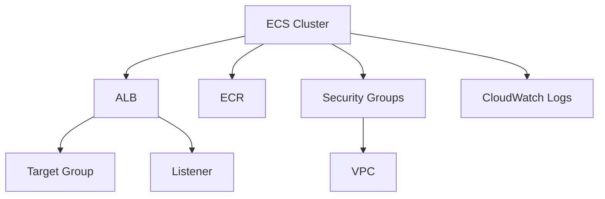

# 🐳 Módulo ECS

Este módulo implementa um serviço ECS (Elastic Container Service) completo na AWS, incluindo recursos necessários para execução de containers de forma escalável e segura.

## 📋 Visão Geral

O módulo ECS cria um ambiente completo para execução de containers, incluindo:
- ECR (Elastic Container Registry)
- Security Groups
- CloudWatch Log Group

E alguns recursos opcionais para ajustes como:
- dynamic blocks para efs se necessário
- listines públicos e privados para se necessário ajusta no serviço


## 🏗️ Recursos Criados

### ECS (Elastic Container Service)

- Subnets privadas
- Configuração do Target Group
- Configuração do Listiner no ALB público ou privado
- circuit breaker habilitado
- Scale configurado para permitir ajustes finos
- Healthy check implementando também permitir ajustes de acordo com cada cenário
- Regras de security groups criado iterando sobre um map de objetos, possibilitando a criação de múltiplas regras
- task role e task execution role permitir serem ajustas.


### ECR (Elastic Container Registry)
- Repositório privado
- Lifecycle policy configurada
- Tags personalizadas por projeto
- Integração com IAM

### Security Groups
- Regras de entrada para HTTP/HTTPS
- Regras de saída para internet
- Tags personalizadas por projeto
- Integração com VPC

### CloudWatch Log Group
- Retenção de logs configurada
- Tags personalizadas por projeto
- Integração com ECS


## ⚙️ Variáveis

| Nome | Tipo | Descrição | Padrão | Obrigatório |
|------|------|-----------|--------|------------|
| `project_name` | string | Nome do projeto | - | Sim |
| `ecs_cluster_name` | string | Nome do cluster ECS | - | Sim |
| `ecs_min_size` | number | Número mínimo de instâncias | 1 | Não |
| `ecs_max_size` | number | Número máximo de instâncias | 3 | Não |
| `ecs_desired_capacity` | number | Capacidade desejada | 2 | Não |

## 🔒 Segurança

### Isolamento de Recursos
- Security Groups específicos para cada componente
- Controle de acesso baseado em IAM
- ECR privado com autenticação

### Monitoramento
- Logs centralizados no CloudWatch
- Health checks no ALB
- Métricas de performance

## 🔄 Dependências



## 🚀 Uso

```hcl
module "ecs" {
  source = "./modules/ecs"
  
  project_name = "meu-projeto"
  ecs_cluster_name = "meu-cluster"
  ecs_min_size = 1
  ecs_max_size = 3
  ecs_desired_capacity = 2
}
```

## 📝 Outputs

| Nome | Descrição |
|------|-----------|
| `cluster_name` | Nome do cluster ECS |
| `listiner_arn` | ARN do listener do ALB |
| `private_subnet_ids` | IDs das subnets privadas |
| `public_subnet_ids` | IDs das subnets públicas |
| `vpc_id` | ID da VPC |

## 🛠️ Manutenção

### Atualização
```bash
terraform plan
terraform apply
```

### Destruição
```bash
terraform destroy
```

## 📌 Notas Importantes

- O módulo é projetado para alta disponibilidade
- Todos os recursos são provisionados de forma idempotente
- As configurações seguem as melhores práticas da AWS
- O ALB é criado em subnets públicas
- O ECR é configurado com lifecycle policy para limpeza automática
- Os logs são retidos por 30 dias por padrão